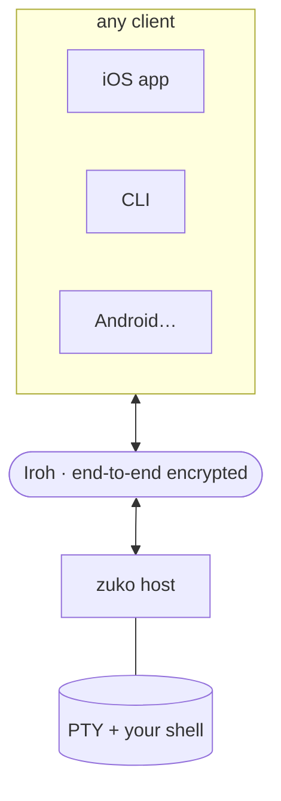

# zuko

**Remote terminals over [Iroh](https://www.iroh.computer/).** Dial by key,
end-to-end encrypted, no open ports or port forwarding. Run the **host** on any
Linux/macOS box you want to reach, then attach a **client** from anywhere —
`vim`, `htop`, tab completion, resize, Ctrl-C all work, because the host runs a
real PTY.

zuko is a small **wire protocol** and a **host daemon**. The reference clients
are the CLI and iOS/iPadOS app; Android and desktop GUI clients can speak the
same protocol later. See [`docs/protocol.md`](docs/protocol.md),
[`docs/clients.md`](docs/clients.md), and [`docs/design.md`](docs/design.md).



- **Pair with a code.** Add a new device with `zuko share` on the host (prints
  a short, minutes-long code) and `zuko <code>` on the other machine. The code
  is a one-time pad over an ephemeral Iroh key — the host's persistent key
  stays put.
- **Real PTY.** Bytes flow verbatim between the client and the host's shell, so
  every terminal program behaves exactly as if it were local.
- **No port forwarding, no relay you run.** Iroh's public relays + NAT
  traversal do the reachability; the connection is end-to-end encrypted by the
  host's key.
- **Service install in the CLI.** `zuko install` writes the systemd/launchd
  user unit and starts the daemon. `zuko uninstall` reverses it.
- **Self-upgrade.** `zuko upgrade` pulls the latest binary via mise and
  restarts the host service onto the new build (mise-managed installs only).
  `--check` previews, `--version <v>` pins, `--no-restart` defers the bounce.

## Clients

Anyone can write a client — zuko is Iroh streams and a tiny frame format. See
[`docs/clients.md`](docs/clients.md) for the full list and
[`docs/protocol.md`](docs/protocol.md) for the spec. Reference implementations:

| Client | Status | Stack | Source |
|--------|--------|-------|--------|
| **CLI** | shipped | Rust 2024 edition + crossterm | the `zuko` binary (`zuko connect`) |
| **iOS / iPadOS** | shipped | Swift 6.2 + [GhosttyTerminal](https://github.com/Lakr233/libghostty-spm) + IrohLib | [`ios/Zuko/`](ios/Zuko) |
| Android | planned | — | — |
| Linux GUI (relm4) | planned | — | — |

The CLI ships in the same `zuko` binary as the host — one install gives you
both. The iOS app is built from source (or pushed to TestFlight from CI; see
[`ios/DISTRIBUTION.md`](ios/DISTRIBUTION.md)).

## Quick start

### 1. Set up a host

Prerequisite: [mise](https://mise.jdx.dev) on the host (`curl https://mise.run | sh`).

On the machine you want to shell into:

```sh
mise use --global github:adonm/zuko   # put `zuko` on PATH
zuko install                          # write the systemd/launchd unit + start it
```

`zuko install` writes a persistent secret key to `~/.config/zuko/key` (on the
first host run), installs a `zuko-host-run` wrapper at `~/.local/bin/`, and
starts a background service (systemd user unit on Linux, launchd on macOS).
Logs go to `journalctl --user -u zuko-host -f` (Linux) or
`~/.config/zuko/zuko-host.out.log` (macOS).

> Manual / no service manager? Run `zuko host` in the foreground, or
> [`scripts/zuko-host.sh`](scripts/zuko-host.sh) from a checkout.
>
> Updates: `zuko upgrade` pulls the newest release via mise and bounces the
> host service. See [`docs/host.md`](docs/host.md#upgrading).

### 2. Pair a client

```sh
# on the host (code is read-once, expires in minutes):
zuko share
#   iridescent-hilton

# on the client:
zuko iridescent-hilton   # fetches the ticket, saves it, connects
```

By default `claim` saves the host under the host's label (override with
`--as <name>`) and drops you straight into the shell. From then on, connect
by name:

```sh
zuko ls                            # list saved hosts
zuko home                          # = zuko connect home (shorthand)
```

### GUI app streaming (Linux)

On Linux, `zuko app <command-or-alias>` runs one Wayland GUI app under cage and
streams it through Kitty graphics over the existing terminal session — no
second port, pairing flow, or desktop client:

```sh
zuko app --list
zuko app firefox
```

Full flag table, the `--test-pattern` → `--doctor` → `--dry-run` diagnostic
workflow, Flatpak alias launching, the RDP-inside-`zuko app` desktop pattern,
runtime deps, and the aarch64 cage caveat are in
[`docs/app.md`](docs/app.md).

**iOS / iPadOS** — see [`ios/Zuko/README.md`](ios/Zuko/README.md) for building
the universal app from source (Simulator or device).

## Session lifetime

Each new session mints a **PTY** on the host, killed when the shell exits. A
short client/network drop detaches that PTY for a 5-minute in-memory lease; the
iOS app auto-redials with the lease token and reattaches. Output produced while
detached is discarded (no replay buffer), and the CLI still exits on drop. For
long-lived work that survives long disconnects or host restarts, run
`tmux`/`zellij`/`screen` *inside* the zuko session.

If the session wedges hard (keystrokes vanish), **Ctrl-C 3× within ~1 s** with
no remote output between presses force-exits the CLI — see
[`docs/host.md`](docs/host.md#force-quitting-the-cli) for the detail.

`zuko share` reads the live `current_ticket` refreshed by `zuko host`; stale
ticket files are rejected so pairing fails closed if the host service is gone.

## Wire protocol

Iroh streams with ALPN `zuko/2` and `zuko/1` fallback. The full spec (frame
types, capability flags, the ticket-handoff ALPN) is in
[`docs/protocol.md`](docs/protocol.md); reference impls in
[`src/wire.rs`](src/wire.rs) (Rust) and
[`ios/ZukoWire/Sources/ZukoWire/Wire.swift`](ios/ZukoWire/Sources/ZukoWire/Wire.swift) (Swift, unit-tested).

## What's in here

| Path | What |
|------|------|
| `src/`, `Cargo.toml` | The `zuko` crate — library + binary + uniffi staticlib. Binary covers host (`zuko host`), CLI client (`zuko connect`/`share`/`claim`), GUI app streaming (`zuko app`), and service installer. `src/ffi.rs` exposes the Argon2id code-derivation for mobile clients. |
| `tests/e2e.rs` | End-to-end PTY harness — spawns host + client, exercises `share`→`claim` over the live Iroh network. |
| `scripts/` | `zuko-host.sh` (foreground dev wrapper), `release.sh` (tag + push). |
| `ios/Zuko/` | The iOS client (xtool + Swift + GhosttyTerminal, networking via IrohLib). |
| `docs/` | [`README.md`](docs/README.md) (index), [`host.md`](docs/host.md) (user guide), [`app.md`](docs/app.md) (`zuko app`), [`protocol.md`](docs/protocol.md) (wire spec), [`design.md`](docs/design.md) (architecture/product rationale), [`clients.md`](docs/clients.md) (client registry), [`releasing.md`](docs/releasing.md) (cutting releases). |
| `.github/workflows/` | CI: build+test `zuko` + iOS app; publish release binaries. |

## Requirements

- Host: any Linux/macOS box with [mise](https://mise.jdx.dev). `mise use
  --global github:adonm/zuko` installs the prebuilt binary; `cargo` is only
  needed to build from source.
- CLI client: same — `mise use --global github:adonm/zuko`.
- iOS/iPadOS client: iOS 26.5+ / iPadOS 26.5+ (IrohLib requirement), Xcode 26+.

## Security notes

- The host's `endpointa…` ticket is the only long-lived secret. It moves only
  through `zuko share` → `zuko claim`: an E2E-encrypted Iroh stream keyed by a
  one-time code; `share`/`claim` never weaken the host key (see
  [`docs/protocol.md`](docs/protocol.md#ticket-handoff)).
- Anyone with the ticket can connect — treat it like an SSH private key.
  Rotate by deleting `~/.config/zuko/key` and restarting; the node id changes
  and all old tickets stop working.

## Development

Tools, system deps, and tasks are defined in [`mise.toml`](mise.toml):

```sh
mise install              # rust (+ system deps via mise bootstrap)
mise run test             # clippy + unit tests
mise run test-e2e         # end-to-end: host<->connect + share<->claim over Iroh
mise run build            # release binary
mise run setup-ios        # install xtool + Swift pieces for local iOS builds
mise run build-ios        # Linux-first xtool iOS build (auto-installs cached SDK)
mise run run-host         # run `zuko host` in the foreground
```

CI uses the same tasks via [`jdx/mise-Action`](https://github.com/jdx/mise-Action),
so local and CI stay in lockstep. Cutting a release is documented in
[`docs/releasing.md`](docs/releasing.md). Contributing guide:
[`docs/contributing.md`](docs/contributing.md). Security policy:
[`docs/security.md`](docs/security.md). The full docs are also published as a
browsable mdBook site (build locally with `mise run build-docs`).

## License

Apache-2.0. See [`LICENSE`](LICENSE).
