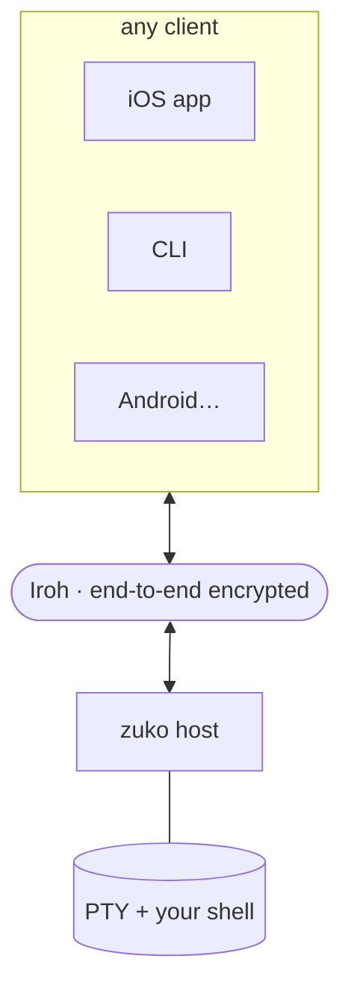

# zuko

**Remote terminals over [Iroh](https://www.iroh.computer/).** Dial by key,
end-to-end encrypted, no open ports or port forwarding. Run the **host** on any
Linux/macOS box you want to reach, then attach a **client** from anywhere —
`vim`, `htop`, tab completion, resize, Ctrl-C all work, because the host runs a
real PTY.

zuko is a small **wire protocol** and a **host daemon**. The reference clients
are the CLI and the iOS/iPadOS app; Android and desktop GUI clients can speak
the same protocol later.



## Quick start

### 1. Set up a host

Prerequisite: [mise](https://mise.jdx.dev) on the host (`curl https://mise.run | sh`).

On the machine you want to shell into:

```sh
mise use --global github:adonm/zuko   # put `zuko` on PATH
zuko install                          # write the systemd/launchd unit + start it
```

> Manual / no service manager? Run `zuko host` in the foreground, or
> [`scripts/zuko-host.sh`](https://github.com/adonm/zuko/blob/main/scripts/zuko-host.sh) from a checkout.
>
> Updates: `zuko upgrade` pulls the newest release via mise and bounces the
> host service. See [Host & CLI](host.md#upgrading).

### 2. Pair a client

```sh
# on the host (code is read-once, expires in minutes):
zuko share
#   iridescent-hilton

# on the client:
zuko iridescent-hilton   # fetches the ticket, saves it, connects
```

From then on, connect by name:

```sh
zuko ls                            # list saved hosts
zuko home                          # = zuko connect home (shorthand)
```

## Where to go next

- New to the host or CLI? Start with [Host & CLI](host.md).
- On Linux and want GUI-app streaming? See [`zuko app`](app.md).
- Writing a client? Read the [wire protocol](protocol.md), then
  [clients](clients.md).
- Architecture rationale: [design notes](design.md).
- Found a vulnerability? See [security](security.md).

The source lives at [github.com/adonm/zuko](https://github.com/adonm/zuko);
the repo root `README.md` has the full feature list and requirements.
Apache-2.0 — see [`LICENSE`](https://github.com/adonm/zuko/blob/main/LICENSE).
