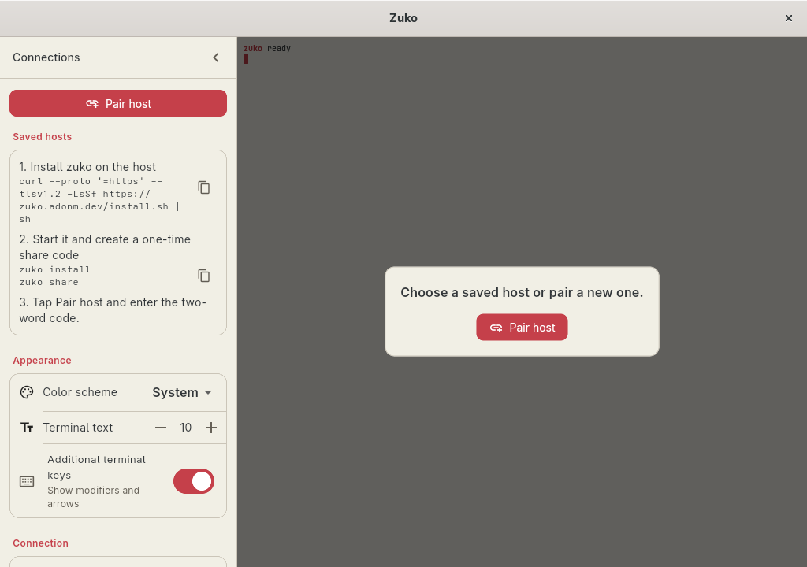

# Linux delivery through FlatPark

Zuko is preparing [FlatPark](https://flatpark.org/) as its Linux Flatpak
distribution channel. FlatPark is an independent community repository and is
not affiliated with Flathub. The package will become installable after its
registry submission is reviewed and published.



Zuko does not build, sign, or host a Flatpak repository. Each immutable GitHub
Release instead contains the official x86_64 Flutter Linux payload:

```text
zuko-linux-vX.Y.Z-x86_64.tar.gz
zuko-linux-vX.Y.Z-x86_64.tar.gz.sha256
```

The archive contains one top-level `bundle/` directory with the executable,
Flutter data, and adjacent libraries. Codemagic builds it against the pinned
Freedesktop 25.08 SDK. `scripts/package-linux-release.sh` normalizes the archive,
rejects links, privileged files, and non-relocatable runtime paths, checks
native linkage before and after extraction, and emits its checksum.

The separate FlatPark registry manifest will download that official release
asset as Flatpak `extra-data`, pin its SHA-256 and byte size, and unpack it
without modifying the application payload. FlatPark owns the wrapper,
AppStream data, repository signing, hosting, and package-update automation.
Users therefore trust both the official Zuko release bytes and FlatPark's
packaging and signing infrastructure; published registry packages are
reviewable in the
[FlatPark registry](https://github.com/flatpark/flatpark/tree/main/registry).

## Install after publication

Once `dev.adonm.zuko` appears in the FlatPark catalog, add FlatPark and Flathub
at the same user scope, then install Zuko:

```sh
flatpak --user remote-add --if-not-exists flatpark \
  https://dl.flatpark.org/flatpark.flatpakrepo
flatpak --user remote-add --if-not-exists flathub \
  https://dl.flathub.org/repo/flathub.flatpakrepo
flatpak --user install flatpark dev.adonm.zuko
flatpak run dev.adonm.zuko
```

The package grants only the capabilities required by the client:

- network access for Iroh;
- IPC, Wayland, and DRI for Flutter rendering;
- access to `org.freedesktop.secrets` for encrypted client state.

It grants no X11 socket and no host or home-directory filesystem access. A
Secret Service provider such as GNOME Keyring or KWallet must be running. If the
login keyring is locked, Zuko leaves encrypted state unchanged and displays an
unlock-and-retry screen.

## Release and update maintenance

The Zuko release workflow publishes the raw archive and checksum. It does not
publish a `.flatpak`, `.flatpakref`, OSTree repository, or repository signing
key. `scripts/collect-codemagic-release.py` and
`scripts/publish-github-release.sh` fail closed unless the expected archive and
checksum are present exactly once.

The submitted package's `resolve-update.sh` will select the exact versioned
Linux archive from the latest GitHub Release. FlatPark's update automation will
compute a new size and checksum and open a reviewed registry update. Changes to
the FlatPark wrapper, permissions, or metadata belong in that registry rather
than this repository.
