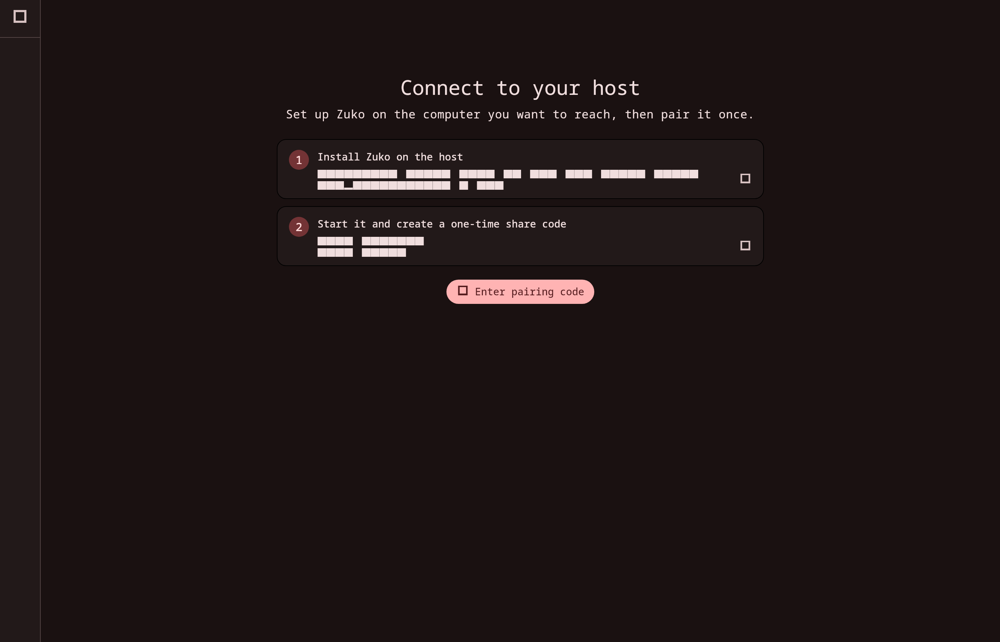
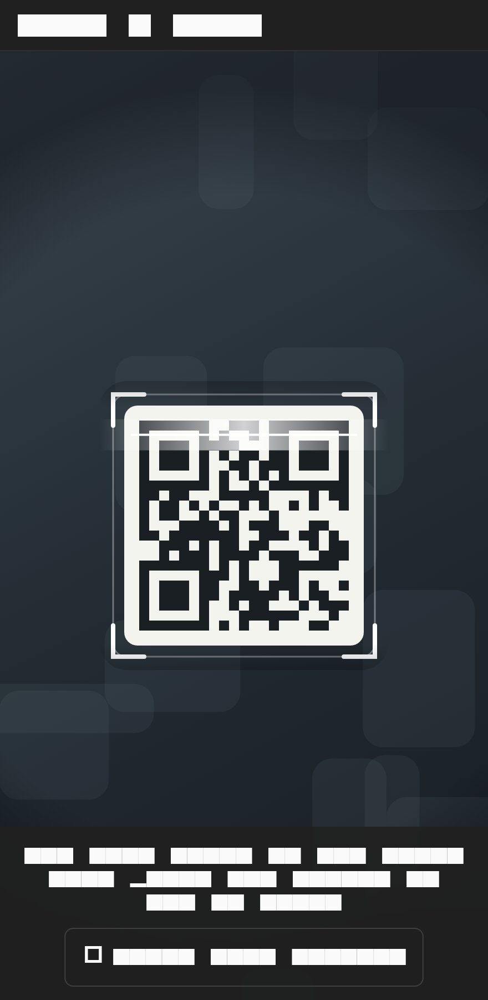
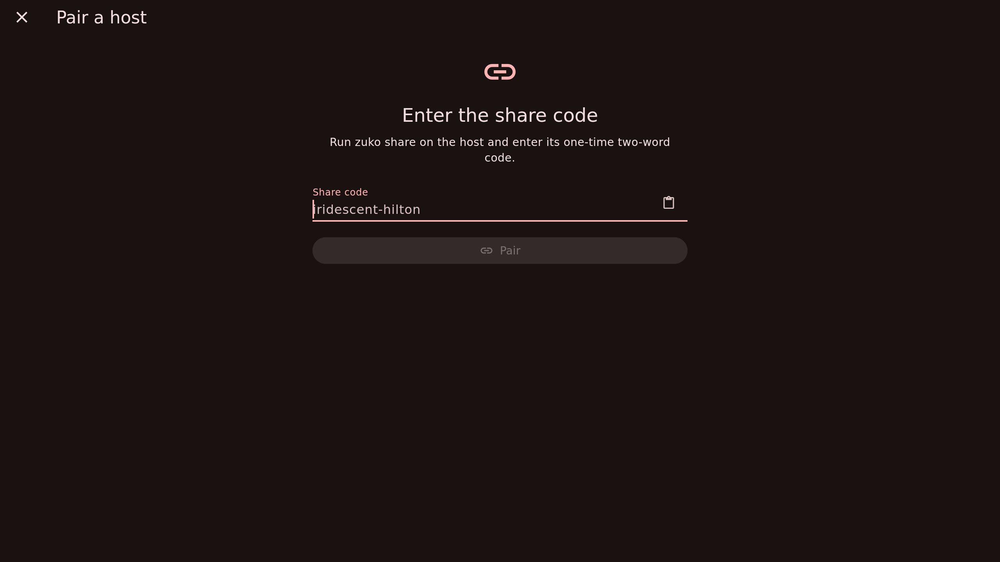
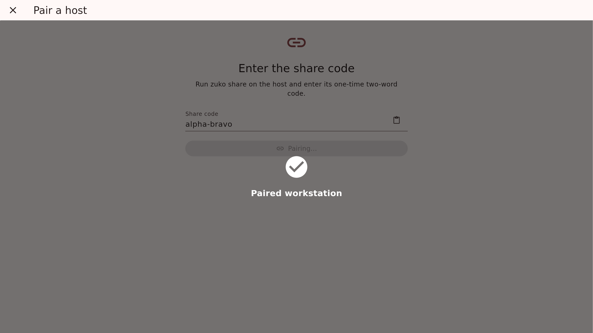
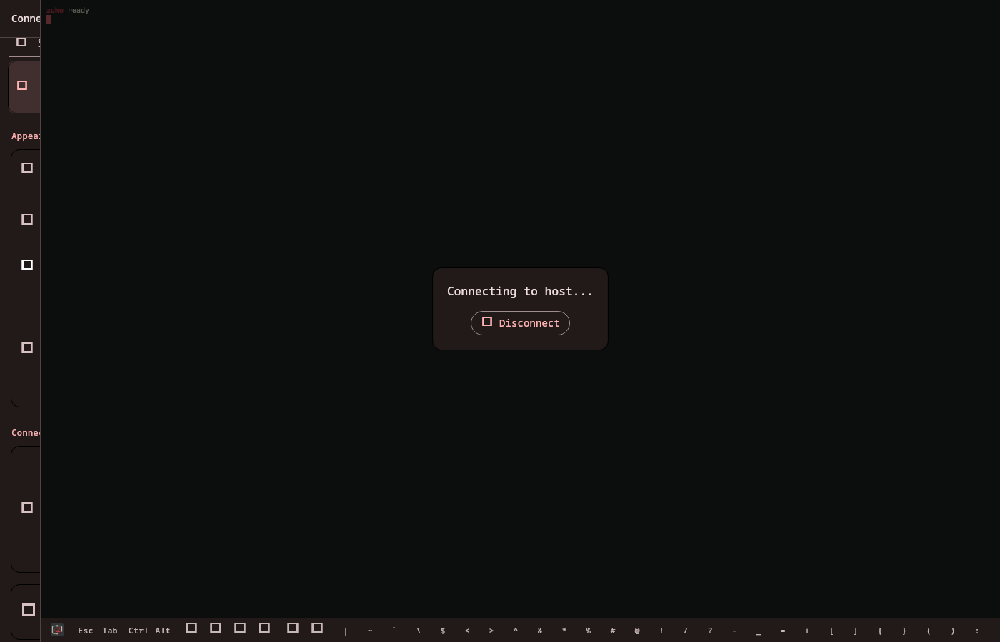
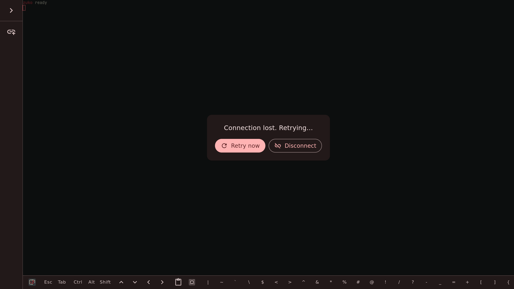
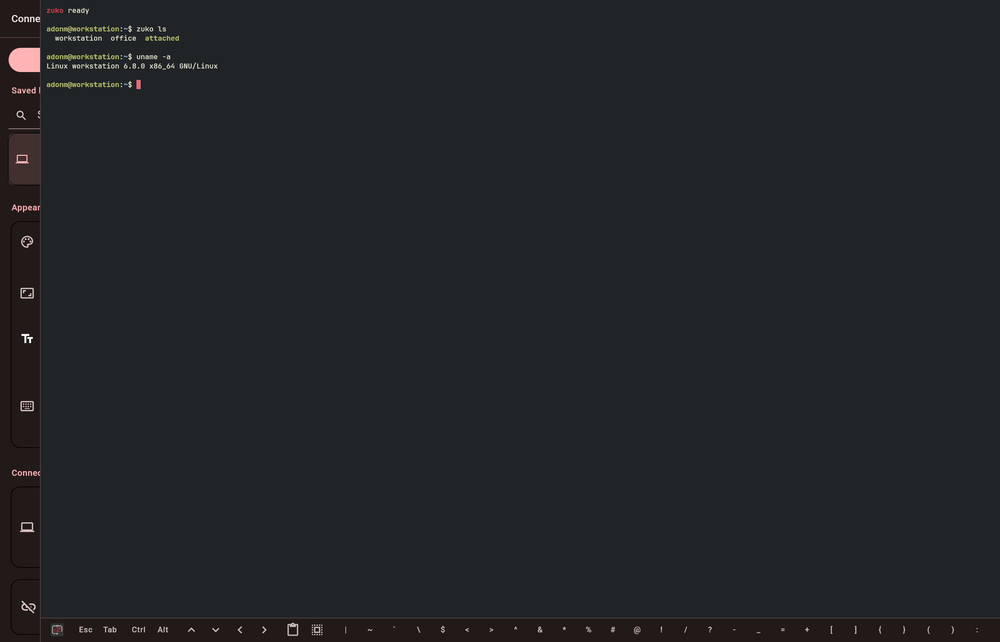
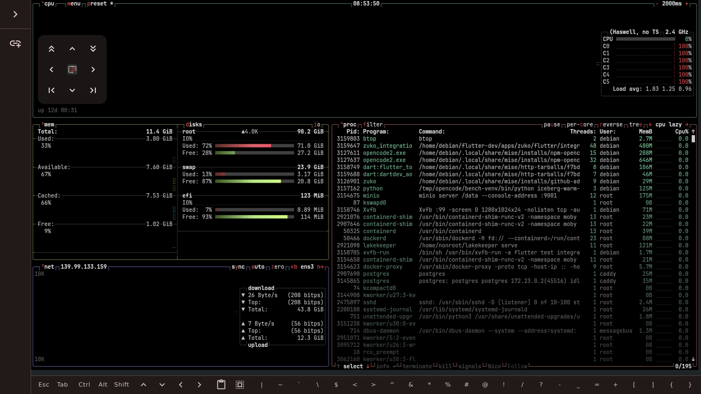
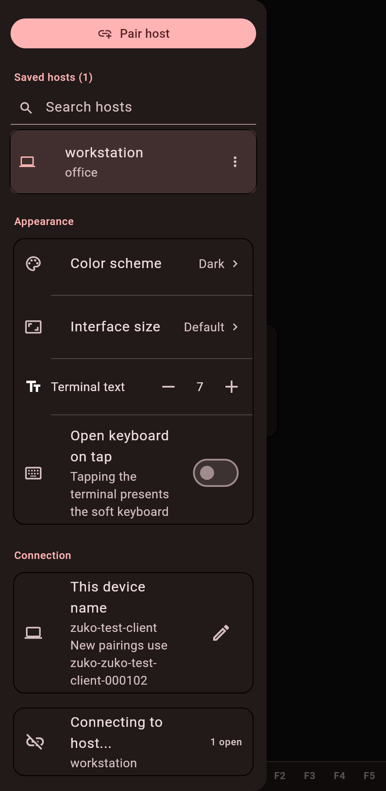
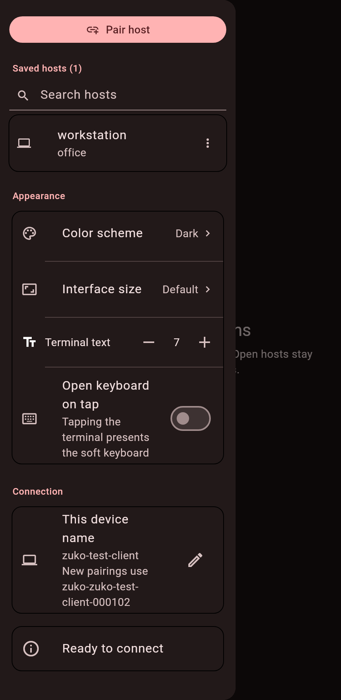

# Pairing and connection flow

A picture-by-picture walkthrough of Zuko: installing the host, claiming a
one-time share code, and opening the terminal — on desktop and on touch.

The main screenshots are captured from the real Linux app (real engine,
bundled fonts) by `flutter/integration/integration_test/screenshot_flow_test.dart`;
the camera screen, which only exists on camera-capable targets, renders from
the widget tree instead. Regenerate everything with `just screenshots`
whenever the pairing or connection UI changes.

## 1. First run

The welcome screen gives the two host-side commands: install Zuko, then
run `zuko share` to mint a one-time share code.

## 2. Claim the share code

On a phone, point the camera at the QR code that `zuko share` prints. The
animated viewfinder brackets the code; a failed claim offers both a retry
and the typed fallback.

Typing the code accepts the canonical two-word form. Pasting works with the
full `zuko share` output — the code is extracted from merged
stdout/stderr, `zuko claim` lines, or `zuko://pair` URIs.

A successful claim confirms the host name before the connection opens.

## 3. Connect to a saved host

Selecting a saved host opens a terminal tab. While the peer connection is
established, the session overlay reports progress and the tab shows the
busy state.

If the link drops, the overlay counts down to the automatic reconnect
attempt; *Retry now* reconnects immediately.

## 4. The terminal

An attached session brings up the terminal with the compact accessory bar.
On wide desktops the sidebar collapses to a slim rail (the logo in the
accessory expands it) and the app bar gives way to native window chrome, so
the terminal fills the window.

Real terminal programs render as they would locally — here btop under the
touch layout's floating pad.

### Touch layout

Touch devices drop the top bar entirely. A translucent floating pad floats
over the terminal and can be dragged anywhere:

- tap a key for arrows, PgUp/PgDn, Home/End (hold to repeat) — PgUp/PgDn
  scroll the terminal view;
- drag the pad to move it anywhere over the terminal;
- tap the center logo to open the sidebar.

The sidebar opens as a drawer over the terminal.

## 5. Re-pairing and revocation

A host that rejects the saved ticket shows a *Pair again* action. Pairing
again records the fresh ticket and the host-side client label, which the
host details dialog exposes as a `zuko rm <label>` revocation command.
